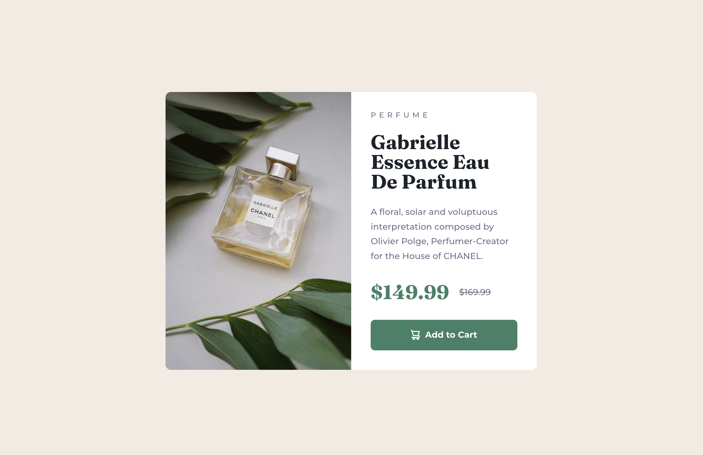

# Frontend Mentor - Product preview card component solution

This is a solution to the [Product preview card component challenge on Frontend Mentor](https://www.frontendmentor.io/challenges/product-preview-card-component-GO7UmttRfa). Frontend Mentor challenges help you improve your coding skills by building realistic projects.

## Table of contents

- [Overview](#overview)
  - [The challenge](#the-challenge)
  - [Screenshot](#screenshot)
  - [Links](#links)
- [My process](#my-process)
  - [Built with](#built-with)
  - [What I learned](#what-i-learned)

**Note: Delete this note and update the table of contents based on what sections you keep.**

## Overview

### The challenge

Users should be able to:

- View the optimal layout depending on their device's screen size
- See hover and focus states for interactive elements

### Screenshot



### Links

- Solution URL: [https://github.com/solvman/product-preview-card-component-main](https://github.com/solvman/product-preview-card-component-main)
- Live Site URL: [https://courageous-fairy-056148.netlify.app/](https://courageous-fairy-056148.netlify.app/)

## My process

### Built with

- Semantic HTML5 markup
- CSS custom properties
- Flexbox
- CSS Grid
- Mobile-first workflow
- [React](https://reactjs.org/) - JS library
- [Next.js](https://nextjs.org/) - React framework
- [Styled Components](https://styled-components.com/) - For styles

**Note: These are just examples. Delete this note and replace the list above with your own choices**

### What I learned

While working on this porject I learned how to use "data-" to create variants of buttons, see below:

```html
<button data-style="cart" class="button">Add to Cart</button>
```

```css
.button {
  color: var(--clr-neutral-100);
  background-color: var(--clr-primary-400);
  text-decoration: none;
  font-weight: var(--fw-bold);
  border: none;
  padding: 0.75rem;
  border-radius: 0.5em;

  display: inline-flex;
  justify-content: center;
  align-items: center;
  gap: 0.5rem;
}

.button[data-style="cart"]::before {
  content: "";
  width: 15px;
  height: 16px;
  background-image: url("./images/icon-cart.svg");
}

.button:is(:hover, :focus) {
  background-color: var(--clr-neutral-700);
}
```
